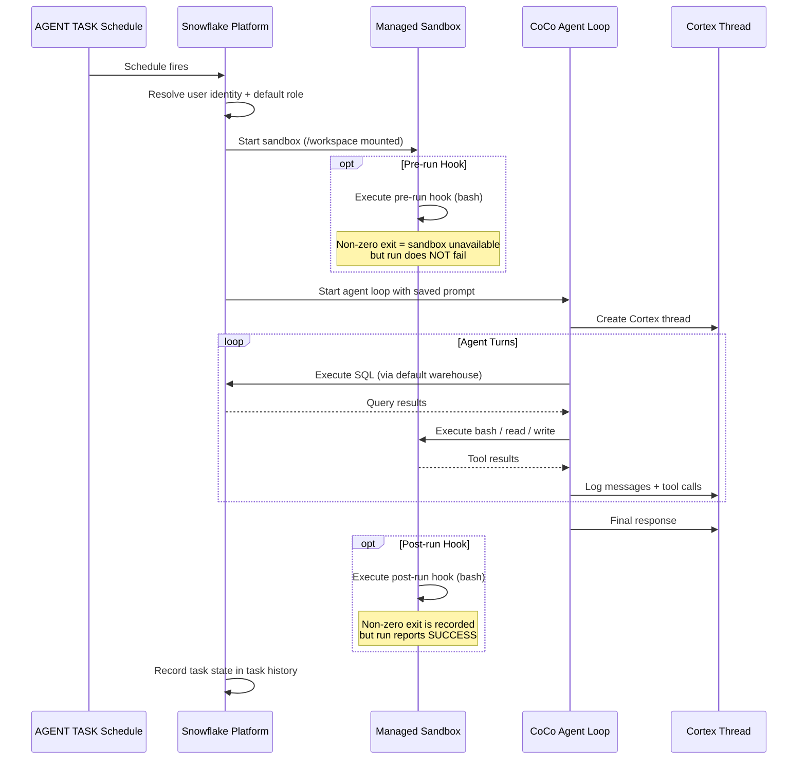

# AGENT TASK Execution Flow

```mermaid
sequenceDiagram
    participant Schedule as AGENT TASK Schedule
    participant SF as Snowflake Platform
    participant Sandbox as Managed Sandbox
    participant CoCo as CoCo Agent Loop
    participant Thread as Cortex Thread

    Schedule->>SF: Schedule fires
    SF->>SF: Resolve user identity + default role
    SF->>Sandbox: Start sandbox (/workspace mounted)

    opt Pre-run Hook
        Sandbox->>Sandbox: Execute pre-run hook (bash)
        Note over Sandbox: Non-zero exit = sandbox unavailable<br/>but run does NOT fail
    end

    SF->>CoCo: Start agent loop with saved prompt
    CoCo->>Thread: Create Cortex thread

    loop Agent Turns
        CoCo->>SF: Execute SQL (via default warehouse)
        SF-->>CoCo: Query results
        CoCo->>Sandbox: Execute bash / read / write
        Sandbox-->>CoCo: Tool results
        CoCo->>Thread: Log messages + tool calls
    end

    CoCo->>Thread: Final response

    opt Post-run Hook
        Sandbox->>Sandbox: Execute post-run hook (bash)
        Note over Sandbox: Non-zero exit is recorded<br/>but run reports SUCCESS
    end

    SF->>SF: Record task state in task history
```
