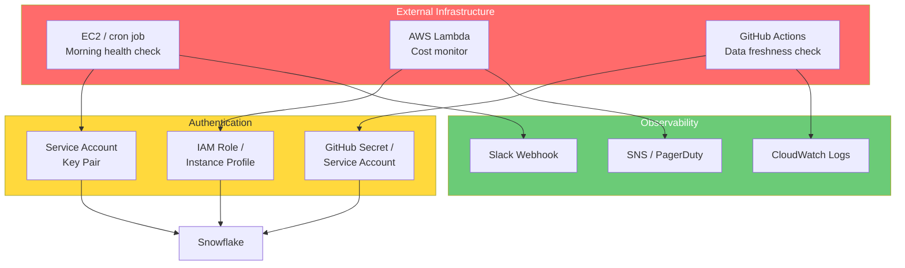
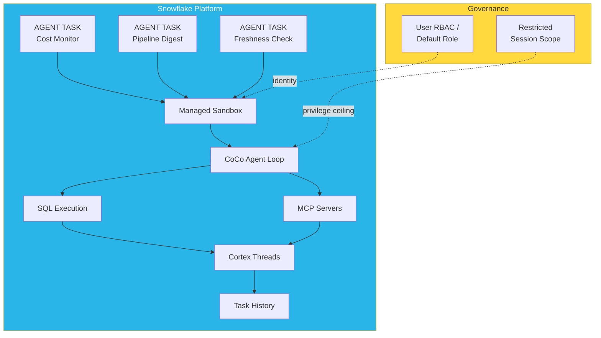

# Before/After Architecture

## Before: Fragmented External Glue

```mermaid
flowchart TB
    subgraph External["External Infrastructure"]
        EC2[EC2 / cron job<br/>Morning health check]
        Lambda[AWS Lambda<br/>Cost monitor]
        GHA[GitHub Actions<br/>Data freshness check]
    end

    subgraph Auth["Authentication"]
        KP[Service Account<br/>Key Pair]
        IAM[IAM Role /<br/>Instance Profile]
        SA[GitHub Secret /<br/>Service Account]
    end

    subgraph Observability["Observability"]
        CW[CloudWatch Logs]
        SNS[SNS / PagerDuty]
        Slack1[Slack Webhook]
    end

    EC2 --> KP --> SF[Snowflake]
    Lambda --> IAM --> SF
    GHA --> SA --> SF

    EC2 --> Slack1
    Lambda --> SNS
    GHA --> CW

    style External fill:#ff6b6b,color:#fff
    style Auth fill:#ffd93d,color:#333
    style Observability fill:#6bcb77,color:#fff
```

## After: Consolidated in Snowflake

```mermaid
flowchart TB
    subgraph Snowflake["Snowflake Platform"]
        AT1[AGENT TASK<br/>Cost Monitor]
        AT2[AGENT TASK<br/>Pipeline Digest]
        AT3[AGENT TASK<br/>Freshness Check]

        AT1 --> Sandbox[Managed Sandbox]
        AT2 --> Sandbox
        AT3 --> Sandbox

        Sandbox --> CoCo[CoCo Agent Loop]
        CoCo --> SQL[SQL Execution]
        CoCo --> MCP[MCP Servers]

        SQL --> Thread[Cortex Threads]
        MCP --> Thread
        Thread --> History[Task History]
    end

    subgraph Governance["Governance"]
        RBAC[User RBAC /<br/>Default Role]
        RSS[Restricted<br/>Session Scope]
    end

    RBAC -.->|identity| Sandbox
    RSS -.->|privilege ceiling| CoCo

    style Snowflake fill:#29B5E8,color:#fff
    style Governance fill:#ffd93d,color:#333
```
