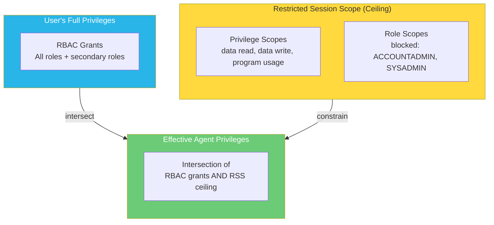
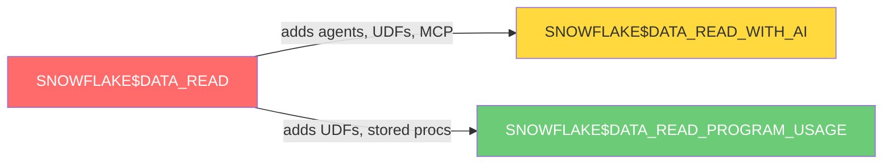

# Restricted Session Scope Hierarchy



## How It Works

```
User's RBAC Privileges:     [READ, WRITE, DDL, GRANT, ACCOUNTADMIN]
RSS Allowed Privileges:     [READ, PROGRAM_USAGE, WRITE(SANDBOX_DB only)]
────────────────────────────────────────────────────────────────────
Effective Agent Privileges: [READ, PROGRAM_USAGE, WRITE(SANDBOX_DB only)]
```

RSS never grants additional privileges. It only removes them. The effective privilege set is the intersection of what the user has through RBAC and what the RSS allows.

## Predefined Scopes


